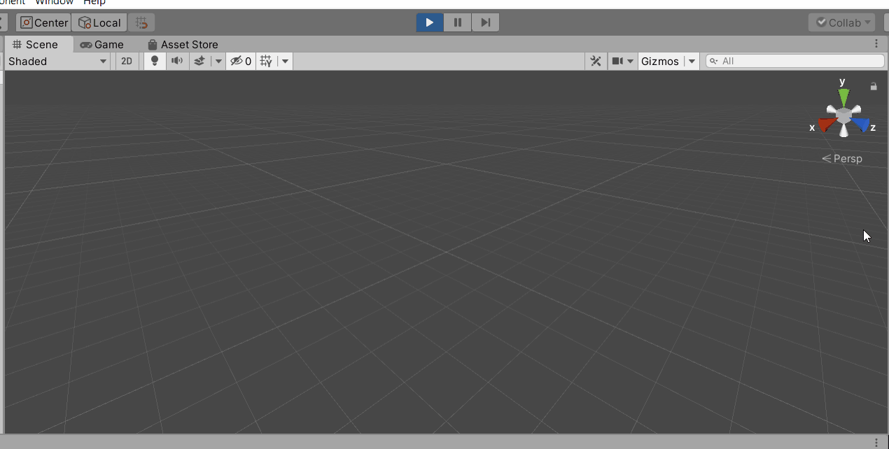
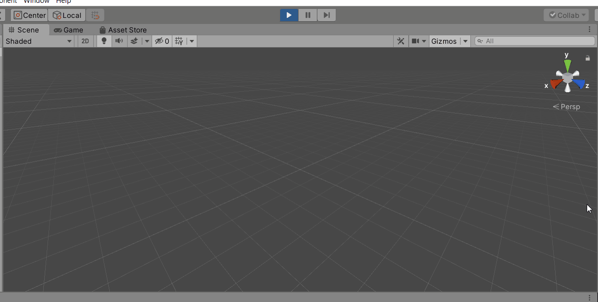
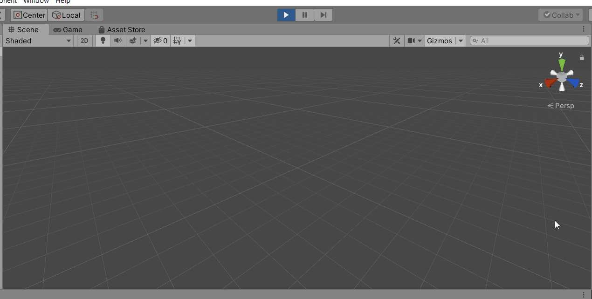

# Assignment 3: Generating Content - Maze Generation

## Maze basic game

I have built the maze game based on tutorial at 'https://catlikecoding.com/unity/tutorials/maze/'

## Generation Methods

I have used 4 maze generation algorithms as follows:

- Recursive Backtracker 
    - Algorithm
        - Choose a starting point in the field.
        - Randomly choose a wall at that point and carve a passage through to the adjacent cell, but only if the adjacent cell has not been visited yet. This becomes the new current cell
        - If all adjacent cells have been visited, back up to the last cell that has uncarved walls and repeat.
        - The algorithm ends when the process has backed all the way up to the starting point.

    - Simulation
        - 

  

- Prim's Algorithm 
    - Algorithm (I used tweaked Growing Tree to represent Prim's algorithm)
        - Let C be a list of cells, initially empty. Add one cell to C, at random.
        - Randomly choose a cell from C, and carve a passage to any unvisited neighbor of that cell, adding that neighbor to C as well. If there are no unvisited neighbors, remove the cell from C.
        - Repeat #2 until C is empty.

    - Simulation
        - 

  

- Growing Tree By Oldest 
    - Algorithm
        - Let C be a list of cells, initially empty. Add one cell to C, at random.
        - Select the oldest active cell, and carve a passage to any unvisited neighbor of that cell, adding that neighbor to C as well. If there are no unvisited neighbors, remove the cell from C.
        - Repeat #2 until C is empty.

    - Simulation
        - 

  

- Growing Tree By Middle 
    - Algorithm
        - Let C be a list of cells, initially empty. Add one cell to C, at random.
        - Select the middle cell in C, and carve a passage to any unvisited neighbor of that cell, adding that neighbor to C as well. If there are no unvisited neighbors, remove the cell from C.
        - Repeat #2 until C is empty.

    - Simulation
        - 

## Evaluation

I have used the maze building time criteria to evaluate the generation methods mentioned above. The results were found as follow:

1. Recursive Backtracker --> 17.1 seconds
2. Growing Tree By Oldest --> 17.9 seconds
3. Growing Tree By Middle --> 18.4 seconds
4. Prim's Algorithm --> 18.9 seconds

## Demo

To demo the different generation methods, uncomment the methods in DoNextGenerationStep method one by one.

