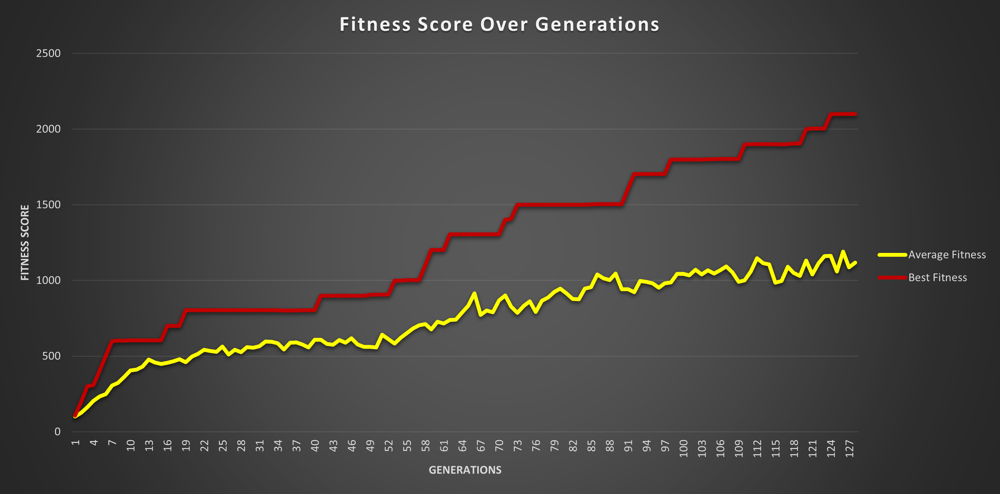

# Genetic Algorithm For a Unity Car Game

## Motivation

This project was performed as a part of the continuous assesment of the WID3009 AI Game Programming course.

It is a group project by group #5.

## Introduction

Applying the genetic algorithm to a game of a car steering in a challenging path. The game was developed in Unity 2019, and the algorithm is implemented in C# as controller for the car agent. 

## The Original Game

The game was predeveloped in Unity 2019. It is simply a car that steers through a twisty road, with realistic physics rules that makes the steering through the path not an easy task even for humans.

This is a s screen record of one of our members playing the game. 

  

## AI Agent

The aim of the project is to create an AI agent that can plays the game in the best way possible. This agent will control the car as if it was a human playing.

## Candidate Agent Algorithms

To create an AI agent that plays such games, we had some options for the algorithm to use, those are the most popular algorithms found in publications that can play games like ours:

1. Tree search algorithms as MCTS
2. Supervised learning algorithms as ANN 
3. Evolutionary Computation as Genetic Algorithm
4. Reinforcement learning 

Due to the abscence of any training data, and the lack of resources to create our training data, we have chosen the Genetic Algorithm due to its simplicity and high performance.

## Genetic Algorithm (GA) 

1. Initial population: Generate the initial population of individuals randomly (First generation).

The process begins with a set of solutions which is called a Population.
A solution is characterized by a couple of parameters (variables): 

  - Vertical Input
  - Horizontal Input

2. Fitness function

The fitness function determines how fit a solution is (the ability of a solution to compete with other solutions). It gives a fitness score to each solution. The probability that a solution will be selected for reproduction is based on its fitness score, our fitness function is as follows:

`fitness = (m_RoadNumbers * 100.0f) + (totalDistance - distanceToNextPosition);`

where:

*   **m_RoadNumbers** is the amount of points the car has gone through
*   **totalDistance** is the distance between the next waypoint and the current waypoint
*   **distanceToNextPosition** is the distance between the next waypoint and the current car position

3. Selection

The idea of selection phase is to select the fittest solutions and let them pass their parameters values to the next generation.

3 solutions (parents) are selected and compete to get the best solution to pass to the next generation. This process repeats until we have a complete population (80 solutions). 

4. Crossover

We are doing uniform crossover, we don’t divide the chromosome into segments, rather we treat each gene separately. Each chromosome has a 50% probability whether or not it’ll be included in the off-spring. 
We can also bias this probability to one parent by adjusting the alpha parmeter.

5. Mutation

We are doing random mutation where a random parameter is selected each time and be assigned a random integer within the allowed range for that parameter.

## Experiments and Results

Initial setup of the experiment

| Variable         	              | Value |
|------------------	              |:-----:|
| Population size  	              |  80 cars        |
| Selection          	          |   10 cars       |
| Crossover    	                  |  0.20 (alpha)   |
| Tournament size  	              |   3   |

### Training Simulation

  

### Results

  

